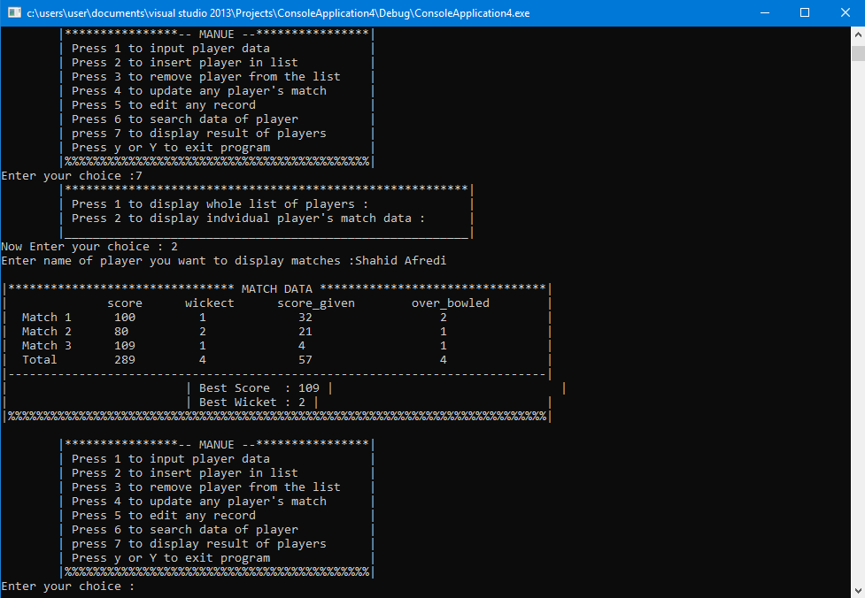

# Player-Management-Sysytem.

You are required to maintain database for Cricket players. There are 9 teams in International Cricket Pakistan, India, South Africa, West Indies, Bangladesh, Srilanka, Austrailia, Newzealand, Ingland. You have to keep records of the players. Player should have information is.
1.	Name
2.	Country
3.	DOB
4.	Date of dabut
5.	Category i.e. Bowler, Batsman, Fielder, All-rounder

6.	Total Scores
7.	Best Score
8.	Total Wickets
9.	Best Wicket figure
10.	Total Over Bowled
11.	Total Scores given

6-11 Attributes should not be taken by user automatically calculated. user should be allowed to add new player, edit existing player, search player by Nationality, by youngest age, by eldest age, by most no of matches, by best batting average, by best batting record, by besting bowling record, by highest wicket taker. Also the user must be facilitated by to delete the record by combining two attributes i.e., DOB and Name. Each of the user choice must be mapped with an equivalent function.
 
When a new player is added new node is created. When you want to update a player means you want to update record of the player 6-11 should be updated automatically. Linked list should be used to implement the required task.
You may use structure “struct time” for getting system time.

<h3>Screenshots</h3>

